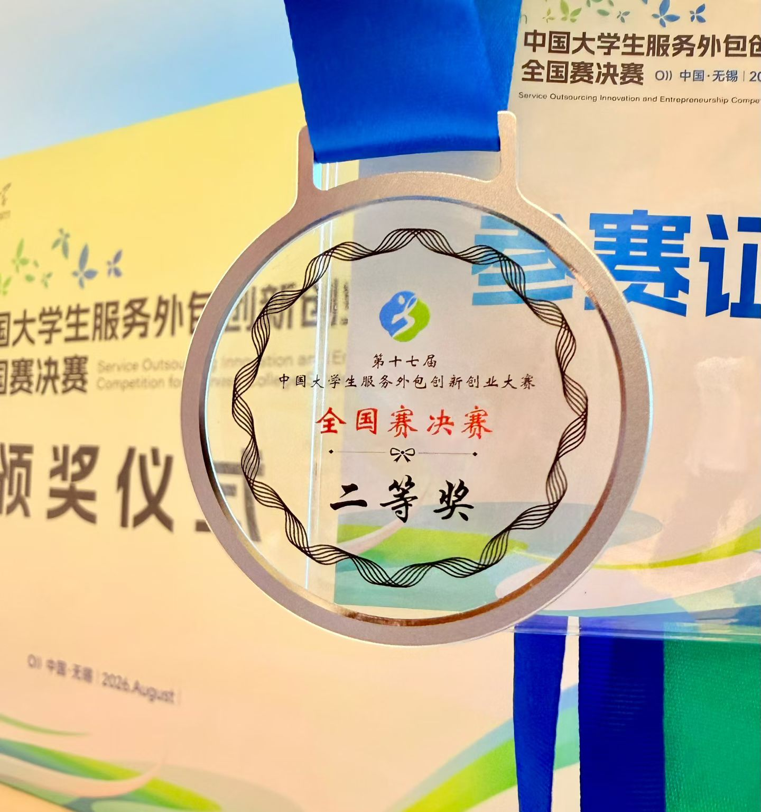
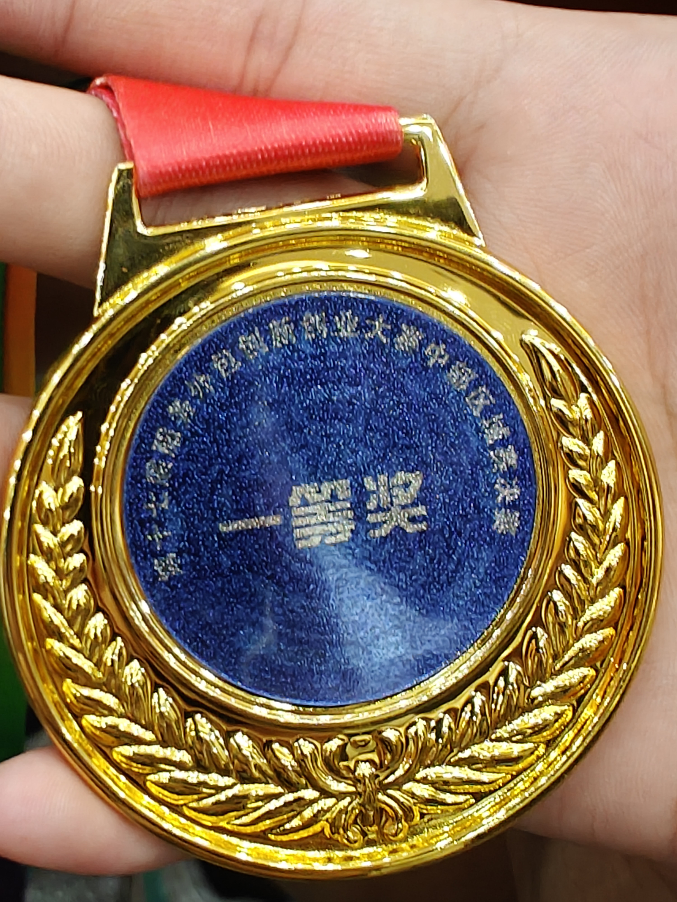

# 感慨

4 月份接手项目时，我刚学 Transformers 不到两个月，Agent 更是头一回接触。整个过程完全是从零起步、边做边学。

项目推进中虽历经波折，但团队合力克服了所有困难，一路走到决赛并圆满收官（虽留有些许遗憾最终只有二等奖 ~~?!区区!?~~ ）。

# 复盘

### 架构优势

项目的整体架构由我独立主导设计，整体表现令人满意。模块间的强解耦与可插拔特性，显著提升了后续开发与迭代的效率。 :spoiler[我说与 DSH 有异曲同工之妙有感觉吗]

### 选型反思

复盘整个周期，前期的技术选型存在明显的得失权衡：

1. **短期效率 vs 长期维护**：初期采用 `Python + React` 确实换来了极快的开发速度；但进入跨平台客户端（iOS / Android）发布阶段后受限明显。
2. **跨端妥协**：由于无法直接本地运行，只能使用 `Capacitor + WebView` 封装远程访问，并在 `localStorage` 与 `IndexedDB` 的本地隐私数据同步上耗费了大量精力。
3. **重构窗口错失**：7 月曾尝试使用 `Rust + Tauri` 重构以实现原生跨平台，但因工期紧张及兼容问题未能赶在决赛前完成，最终只能带着 Python 方案参赛。

# 归档项目

以下仓库自即日起停止维护：

::github{repo="Hill-1024/Lawyance/tree/lawver"}
::github{repo="Hill-1024/Lawyance_Intro"}
::github{repo="Hill-1024/lawyance-rust"}

# 结语

赶赴下一程，致我的队友们，有缘再见
