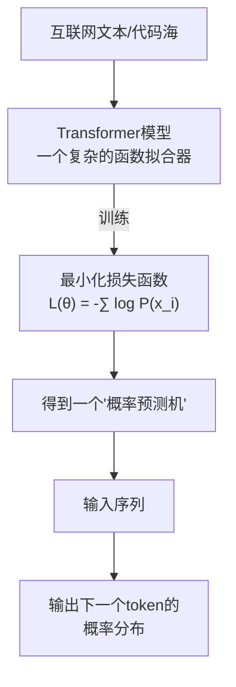

> 拟合之外，别无魔法

## 缘起：一个寒假与Transformer

今年寒假，我作为一名大一学生，有幸跟随老师系统学习了Transformer架构。从注意力机制到前馈网络，从位置编码到损失函数。当一行行代码、一个个矩阵乘法在我面前展开时，那个曾经笼罩在迷雾中的“人工智能”，突然变得清晰、直白，甚至有些……平淡。

我意识到一件简单到令人失望的事：如今最先进的大语言模型，其数学本质就是一个**极度复杂的拟合函数**。

$$
f_{\theta}(x) = P(x_{t+1} | x_1, x_2, ..., x_t)
$$

它的“进步”可以粗略归结为三点：
1. 更快的梯度下降（优化算法）
2. 更高的参数量（模型的“阶数”）
3. 更多的数据与算力（燃料）

然后，就没有什么“然后”了。

## 祛魅：当魔法变为工程

在理解其原理后，那种对AI“拟人智能”的敬畏感迅速消退。这并非贬低它的成就，而是将其放回正确的位置：

它的工作流程，优雅而冰冷。它不懂“爱情”的甜蜜与痛苦，只是从统计上知道“爱情”这个词后，高概率会出现“浪漫”、“心痛”或“永恒”。它不懂“解方程”的数学意义，只是从海量例题中学会了从“问题字符串”到“答案字符串”的模式映射。

这就是著名的**中文屋隐喻**的工程实现：一个不理解中文的人，凭借一本完美的规则手册（大模型），可以让屋外的中国人以为他精通中文。如今的AI，就是那本用万亿参数写成的规则手册。

## 成就真实，边界也真实

祛魅不是否定。正因祛魅，我们才能更清醒地看到它**真正强大之处**：

- **它是人类知识的超级压缩索引**：将互联网的精华（与糟粕）编码在权重中，随时调用。
- **它是创造力与生产力的杠杆**：能将一个模糊的指令，快速展开为文案、代码或方案草稿，极大降低创作门槛。
- **它是特定认知任务的强大外挂**：翻译、总结、信息提取等任务，它做得比绝大多数人更快、更稳。

但它的边界同样清晰：

- **没有理解，只有关联**：它不“懂”任何东西。它的“思考”是即时的、前向的、无目的的。
- **没有主体性，没有意图**：它的“目标”完全由训练时的损失函数和你的提示词定义。它不想赢，只是不想预测错。
- **是镜子，不是光源**：它的输出本质是训练数据的反射与重组。其观点、风格甚至偏见，都是人类世界的倒影。

## 理性相处：与这位“超级拟合者”为伍

认识到这些之后，我们应如何自处？

1.  **做它的“大脑”与“良知”**：你提供意图、方向和价值观判断。让它成为你手中最强大的执行工具，而不是替你决策的“大脑”。
2.  **质疑一切输出**：对AI生成的内容，尤其是事实、引用、逻辑链条，必须保持核实习惯。它只是在“生成合理的下文”，而非“陈述真理”。
3.  **专注AI做不了的事**：真实的体验、情感的联结、跨领域的直觉、对意义的追寻、基于伦理的抉择……这些构成人类独特价值的部分，正在因AI的对比而愈发珍贵。
4.  **理解其原理，摆脱恐惧与狂热**：知其强大之源，亦知其局限所在。既不陷入“取代一切”的恐慌，也不抱持“无所不能”的幻想。

## 结语

人工智能，特别是AIGC，是一项震撼的工程奇迹。但当我们掀开帷幕，看到后面是巨大的数据中心、精巧的数学和人类浩瀚的数据遗产时，我们反而能更踏实、更理性地与之相处。

它不是一个即将觉醒的神明，也不是一个冰冷的天网。它是一面由数学打造的、前所未有的镜子，一面能够与我们进行复杂交互的镜子。

我们凝视它，看到的应是人类集体智慧的光辉倒影，以及镜前那个**独一无二、必须为自己负责的我们自己**。

祛魅之后，真正的故事——关于我们如何利用工具、如何定义自身——才刚开始。

---
*（本文成稿过程中，作者使用了AI工具进行语句润色和格式调整，这本身正是“理性使用”的一次实践。）*